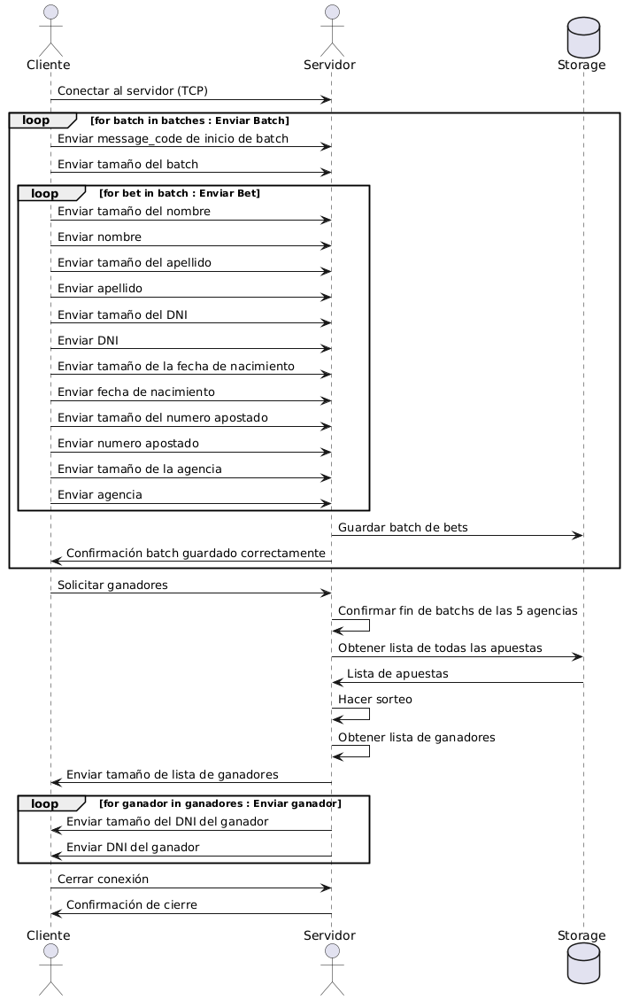

# TP0: Docker + Comunicaciones + Concurrencia

## Parte 3: Repaso de Concurrencia

En este ejercicio es importante considerar los mecanismos de sincronización a utilizar para el correcto funcionamiento de la persistencia.

### Ejercicio N°8

Modificar el servidor para que permita aceptar conexiones y procesar mensajes en paralelo. En caso de que el alumno implemente el servidor en Python utilizando _multithreading_,  deberán tenerse en cuenta las [limitaciones propias del lenguaje](https://wiki.python.org/moin/GlobalInterpreterLock).

### Solución

#### Análisis previo

Para que el servidor pueda aceptar conexiones y procesar mensajes en paralelo, hay que prestar atención a las secciones críticas del código y a las funciones que no son thread-safe.

A priori, tengo las siguientes secciones críticas:

1. La lista de clientes conectados: Cada vez que un nuevo cliente llega, este es aceptado y se lo agrega a la lista de clientes conectados. Por lo tanto, alguien puede llegar a conectarse mientras estoy consultando la cantidad de conectados (ya sea por consulta o porque estoy en medio de un proceso de borrado)

2. El contador de agencias completadas: La idea es la misma que en el anterior, una agencia puede que quiera agregarse como completada, al mismo tiempo que estoy consultado si ya todas terminaron para empezar el sorteo.

Por otra parte, ya la cátedra nos avisa que las funciones `def has_won(bet: Bet) -> bool:` , `def store_bets(bets: list[Bet]) -> None:` y `def load_bets() -> list[Bet]:` no son thread-safe. Esto quiere decir que debo de encargarme desde el lado del servidor de asegurarme que dos hilos no quieran utilizar estas funciones porque pueden quedar en un estado corrompido/inválido.

#### Solución propuesta

##### Uso de multithreading y análisis del GIL

Para el servidor use Threads a través del `ThreadPoolExecutor` para manejar múltiples clientse al mismo tiempo. A pesar de la limitación del Global Interpreter LOck (GIL), este planteo es válido porque como este servidor está basado en I/O, los hilos pueden seguir aceptando conexiones y procesando mensajes mientras esperan operaciones de red (recibir o enviar datos).

##### Aceptación de clientes en paralelo

El servidor usa `ThreadPoolExecutor` para manejar múltiples clientes simultáneamente. En el método `run()`, cuando un cliente se conecta, se usa `executor.submit(self.__handle_client_connection, client_sock)`, lo que delega la comunicación con ese cliente a un hilo diferente, permitiendo que el servidor siga aceptando nuevas conexiones sin bloquearse.

###### Funcionamiento del `ThreadPoolExecutor`

```python
with ThreadPoolExecutor(max_workers=self._max_workers) as executor:
    while not self._was_closed:
        try:
            client_sock = self.__accept_new_connection()
            executor.submit(self.__handle_client_connection, client_sock)
        except OSError as e:
            if self._was_closed:
                break
```

Usé `ThreadPoolExecutor` porque el Pool gestiona automáticamente la concurrencia, evitando crear y destruir threads innecesariamente. El `executor.submit(self.__handle_client_connection, client_sock)` ejecuta la función `self.__handle_client_connection` en thread del pool. Cuando with termina, `ThreadPoolExecutor` espera a que todos los threads finalicen antes de cerrar el pool.

Obs: Le asigné un número de `max_workers` de 10, pero podría ser modificado tranquilamente. La realidad es que como solo tenemos 5 clientes máximo, en prncipio daría lo mismo.

##### Procesamiento concurrente de Mensajes

Una vez que un cliente está conectado, el método `__handle_client_connection()` entra en un bucle donde:

1. Recibe un mensaje (`receive_message_code`)

2. Decide qué hacer según el código del mensaje

3. Procesa la solicitud en el mismo hilo del cliente

Dado que cada cliente se maneja en un hilo separado, varias agencias pueden enviar bets (o batch de bets) al mismo tiempo.

##### Sincronización con Locks

Se usn locks para evitar problemas de concurrencia cuando varios hilos intentan modificar recursos compartidos como:

- Lista de clientes conectados (`self._clients_conected`) -> Se protege mediante el lock `_clients_conected_lock`
- Contador de agencias completadas (`self._agencys_completed`) -> Se protege mediante el lock `_agencys_completed_lock`
- Acceso al almacenamiento de bets (`store_bets()` y `load_bets()`)  -> Se protege mediante el lock `_storage_lock`

Ejemplo en `process_batch_of_bets()`:

```python
with self._storage_lock:
    store_bets(bets)
```

Esto garantiza que solo un hilo acceda a store_bets() a la vez, evitando corrupción de datos.

## Comentarios generales sobre el TP

### Modificaciones a lo largo de las ramas

1. Me di cuenta durante el desarrollo del ej 7 que solo habia puesto el signal en el server para el SIGTERM y no el SIGINT, asi que fui y lo agregué en las distintas ramas.
2. Tanto el protocolo del servidor como el del cliente sufrieron cambios a lo largo del TP. Cuando hice el primer modelo durante el ejercicio 5, rápido me di cuenta que no escalaba muy bien. Asi que tuve que ir agregándole partes, como el `message_code` que se ve a partir de la rama 6.
3. En la misma línea que el comentario anterior, los Send y Receive se modificaron para que fueran ágnosticos al tamaño que se le pasaran y directamente enviaran el largo de la data que se le pasaba. También aplica al serializador que me di cuenta que era innecesario tener un tipo de dato `bet_serializado` sino que era mas facil tener las funciones para serializar cada dato y enviarlos directamente.

### Comandos

- Se cuenta con el script de bash `./generar-compose.sh <nombre_Del_archivo_de_salida> <cant_clientes>` que se encarga de generar el docker-compose. Por ejemplo, para correr 5 clients tendremos: `./generar-compose.sh docker-compose-dev.yaml 5`

- Para levantar, ejecutar y detener los dockers siguen siendo los mismos comandos dados por la cátedra: `make docker-compose-up`, `make docker-compose-logs`, `make docker-compose-down`

- Si se quiere cortar la ejecución de alguno de los contenedores, se debe tener una consola aparte de la que esta corriendo el contenedor y corer: `docker kill --signal=SIGTERM <nombre_del_contenedor_a_detener>`. Por ejemplo, si quisieramos detener el server haríamos: `docker kill --signal=SIGTERM server`

OBS: El validador del echo server solo sirve en la rama 3 porque después se fue modificando el servidor y, obviamente, ya no se más un echo-server. Pero si se quiere correr, se va hasta la rama 3 y se ejecuta con `./validar-echo-server.sh`

### Protocolo

#### Cliente a Servidor

Tenemos en general 3 tipos de mensajes, de acuerdo a lo que se va a enviar, todo de tipo uint8:

| Código | Descripción                  |
| ------ | ---------------------------- |
| `1`    | Enviar una Bet               |
| `2`    | Inicio de batch de bets      |
| ~~`3`~~    | ~~Fin de lote de apuestas~~  (A partir de la rama 7 no se usa)     |
| `4`    | Solicitar lista de ganadores |

##### Envío de una bet

Cada vez que se manda una Bet este tendrá el siguiente orden de envío:

| Campo | Tipo | Descripción |
|--------|------|-------------|
| `Bet_message_code` | `uint8` | Código del mensaje de apuesta (`1`). |
| `size_first_name` | `uint32` | Tamaño del nombre. |
| `first_name` | `[]bytes` | Nombre del apostador. |
| `size_last_name` | `uint32` | Tamaño del apellido. |
| `last_name` | `[]bytes` | Apellido del apostador. |
| `size_document` | `uint32` | Tamaño del documento. |
| `document` | `[]bytes` | Documento de identidad. |
| `size_birthdate` | `uint32` | Tamaño de la fecha de nacimiento. |
| `birthdate` | `[]bytes` | Fecha de nacimiento en formato `YYYY-MM-DD`. |
| `size_agency` | `uint32` | Tamaño del identificador de agencia. |
| `agency` | `[]bytes` | Identificador de la agencia. |

##### Envío de un batch de bets

Cuando se envía un batch de bets, se envía el código `2` correspondiente a batch_message y luego se itera la lista de bets mandandolos como se menciona en el punto anterior, pero sin enviar el `Bet_message_code` pues el servidor ya sabe que se están enviando este tipo de datos.

##### Solicitar ganadores

En este caso se envía solamente el código `4` y el servidor deberá responder: Primero con la cantidad de ganadores (como uint32), y luego con los documentos de cada uno (se siguió la misma lógica que con los bets: primero se envia el len del documento como uint32 y luego una slice de Bytes con el documento en si)

#### Servidor a Cliente

##### Códigos de confirmación

Tanto si se envío una bet sola o un batch de bets, se devolverá un uint8 con el resultado de todo el proceso: En caso de éxito se devolverá 0 y en caso de que ocurriese alguna falla se devolverá 1.

##### Lista de Ganadores

Cuando el cliente solicita la lista de ganadores, el servidor responde con:

1. `uint32`: Número de ganadores.
2. Para cada ganador:
   - `uint32`: Documento de identidad del ganador.

#### Ejemplo de Comunicación

```plaintext
1. Cliente → Servidor: Enviar inicio de batch (`START_OF_BATCH_MESSAGE_CODE`).
2. Cliente → Servidor: Enviar tamaño del batch (`uint32`).
3. Cliente → Servidor: Enviar apuestas:
      4. Cliente → Servidor: Enviar tamaño del campo (`uint32`) y luego el campo encodeado (`[]bytes`)
5. Servidor → Cliente: Confirmación de recepción (`uint8`).
6. Cliente → Servidor: Solicitar lista de ganadores (`GET_WINNERS_MESSAGE_CODE`).
7. Servidor → Cliente: Enviar cantidad de ganadores (`uint32`).
8. Servidor → Cliente: Enviar documentos de ganadores (`uint32` por cada ganador).
```

### Max Batch Amount

En el ejercicio 6 pedían que pusieramos un max batch amount que no superara los 8 kB. Para estimar este valor lo que hice fue, usar para estimar el dato de ese ejercicio (NOMBRE="Santiago Lionel" APELLIDO="Lorca" DOCUMENTO="30904465" NACIMIENTO="1999-03-17" NUMERO="7574" AGENCIA="0"):

Cálculo del tamaño de una apuesta:

- Cada apuesta contiene los siguientes datos:
  - Bet_message_code (omitido en batch) → 0 bytes
  - size_first_name → 4 bytes
  - first_name → longitud variable
  - size_last_name → 4 bytes
  - last_name → longitud variable
  - size_document → 4 bytes
  - document → longitud variable
  - size_birthdate → 4 bytes
  - birthdate (YYYY-MM-DD, siempre 10 bytes)
  - size_agency → 4 bytes
  - agency → longitud variable

Entonces, los campos de tamaño fijo suman: 4 + 4 + 4 + 4 + 10 + 4 = 30 bytes

Asumiendo como valores promedio para los campos variables:

- Nombre: Santiago Lionel → 16 bytes
- Apellido: Lorca → 5 bytes
- Documento: 30904465 → 8 bytes
- Agencia: 1 → 1 bytes

Entones, los campos de tamaño variable suman: 16 + 5 + 8 + 1 = 30

Entonces, en total, una apuesta ocuparía: 30 + 30 = 60 bytes

Si configuramos batchMaxAmount = 100 apuestas por batch: 60 bytes * 100 = 6.0 kB < 8 kB

Ahora, Si batchMaxAmount = 150: 60 bytes * 150 = 9.0 kB > Supera los 8 kB

Asi que podemos tomar un valor alrededor de 100 y no habría problema, en principio. Hay que recordar que como tenemos datos variables, si llegaramos a tener un batch con nombre y apellidos muy largos, podríamos pasarnos. Yo elegí 100 para tener margen de error.

### Diagrama de secuencia general del TP


