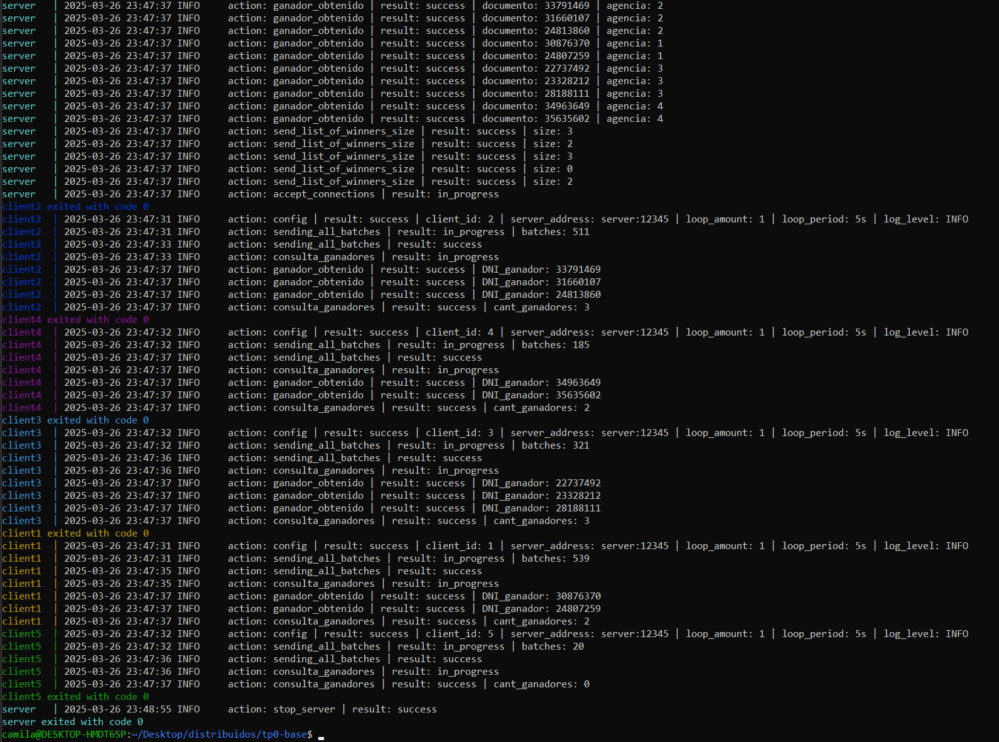

# TP0: Docker + Comunicaciones + Concurrencia

## Parte 2: Repaso de Comunicaciones

### Ejercicio N°7

Modificar los clientes para que notifiquen al servidor al finalizar con el envío de todas las apuestas y así proceder con el sorteo.
Inmediatamente después de la notificacion, los clientes consultarán la lista de ganadores del sorteo correspondientes a su agencia.
Una vez el cliente obtenga los resultados, deberá imprimir por log: `action: consulta_ganadores | result: success | cant_ganadores: ${CANT}`.

El servidor deberá esperar la notificación de las 5 agencias para considerar que se realizó el sorteo e imprimir por log: `action: sorteo | result: success`.
Luego de este evento, podrá verificar cada apuesta con las funciones `load_bets(...)` y `has_won(...)` y retornar los DNI de los ganadores de la agencia en cuestión. Antes del sorteo no se podrán responder consultas por la lista de ganadores con información parcial.

Las funciones `load_bets(...)` y `has_won(...)` son provistas por la cátedra y no podrán ser modificadas por el alumno.

No es correcto realizar un broadcast de todos los ganadores hacia todas las agencias, se espera que se informen los DNIs ganadores que correspondan a cada una de ellas.

### Solución

#### Cambios al protocolo

1. Antes de cada mensaje se envia un codigo con el tipo de dato que vendrá a continuación (todos como uint8):

   | Código | Descripción                |
   |--------|----------------------------|
   | 1      | Nuevo Bet                  |
   | 2      | Nuevo Batch de Bets        |
   | 4      | Pedido de Sorteo           |

    - Nota: El 3 se usaba antes para aviso de fin de envío de batches pero con los cambios ya no hizo falta

2. Cuando se manda un batch de bets, ya no se manda el codigo de mensaje de nuevo bet, pues el server ya está esperando ese tipo de dato

#### Modificaciones generales

1. Se modificaron los Send y Receives para que queden agnósticos al tipo de dato y simplemente envíen el largo total de la cadena de bytes que se le pase

2. El server cierra las conexiones después de haber enviado los ganadores a cada cliente.
    - Lección aprendida: Aca estuve peleando un rato largo porque los clientes querían leer de un socket cerrado y obviamente rompía. Poniendo el `try-finally` de `def process_winners(self):` y cerrando los sockets luego de enviar la data se solucionó.

#### Nota al corrector

Se tuvo que agregar un sleep de 50 segundos en el cliente para que las pruebas pasen correctamente. Si se quita el sleep y se corren los datasets dados por la cátedra no hay ningún problema

